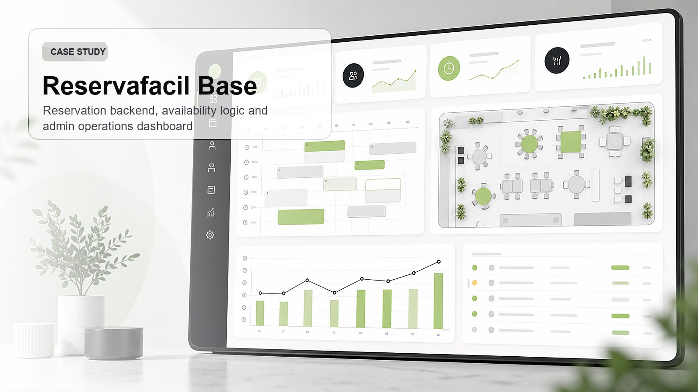
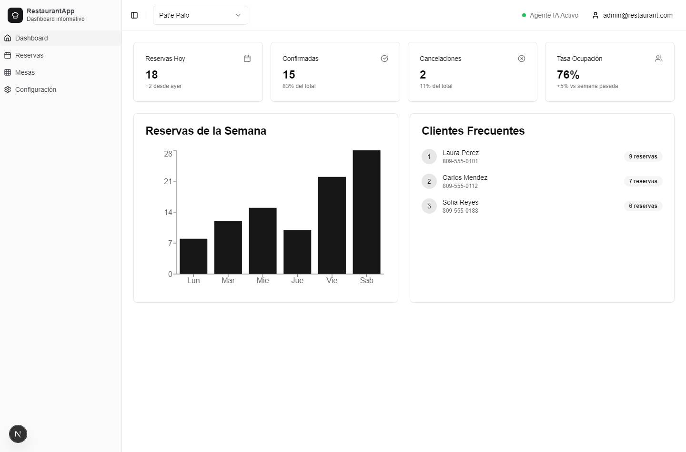

# Reservafacil Base / RestaurantApp

Reservafacil Base is a restaurant reservation platform with a FastAPI backend and a Next.js administrative dashboard. It is designed to support multi-restaurant operations and expose agent-friendly endpoints for voice or chat booking flows.



Portfolio cover generated for presentation. Runtime screenshot:



## What it demonstrates

- Restaurant dashboard with reservations, tables, configuration and KPIs.
- FastAPI backend with JWT authentication.
- Availability engine for reservation slots and table rotation.
- Public agent endpoints for checking availability and creating reservations.
- Next.js dashboard using reusable UI components and charting.
- Deployment-oriented structure with Docker, Nginx and Coolify notes.

## Stack

- FastAPI
- SQLAlchemy and Alembic
- PostgreSQL
- Next.js
- React
- Tailwind CSS
- shadcn/ui
- Recharts
- Docker

## Architecture

```text
backend/
  app/
    routers/
    services/
    schemas/
    db/
frontend/
  app/
  components/
  contexts/
  lib/
```

## Run locally

Backend:

```bash
cd backend
pip install -r requirements.txt
alembic upgrade head
uvicorn app.main:app --reload --port 8000
```

Frontend:

```bash
cd frontend
npm install --legacy-peer-deps
npm run dev
```

## Agent API

- `POST /api/v1/agent/check-availability`
- `POST /api/v1/agent/create-reservation`
- `GET /api/v1/dashboard/stats`
